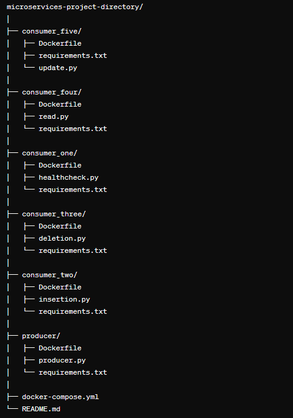

# Microservice Communication with RabbitMQ

## Introduction
Microservices architecture is a widely adopted approach for building scalable and resilient applications. In this project, we demonstrate how to implement a microservices architecture using RabbitMQ as the messaging broker for communication between services. The architecture consists of a producer service responsible for handling HTTP requests and distributing them to various consumer services.

## Prerequisites
- Docker ( Windows | Ubuntu | MacOS )
- Rabbitmq Docker image (Documentation for [rabbitMQ](https://www.rabbitmq.com/getstarted.html))
- Any language of choice (Python is recommended)
- Postman (cURL can be used if not postman)
- Any DataBase of choice (MongoDB/SQL preferably)

## Problem Statement
Building and deploying a microservices architecture where multiple components communicate with each other using RabbitMQ. A message broker is an architectural pattern for message validation, transformation and routing. For the scope of this project, we will build 4 microservices: A HTTP server that handles incoming requests to perform CRUD operations on a Student Management Database + Check the health of the RabbitMQ connection, a microservice that acts as the health check endpoint, a microservice that inserts a single student record, a microservice that retrieves student records, a microservice that deletes a student record given the SRN.

## File Structure

## Project Structure
## **Create Docker Networks**:
 Manually create two Docker networks. One network will host the RabbitMQ image, and the other will hold all the remaining microservices. Start a RabbitMQ container on the network created for RabbitMQ. Access this network through its gateway IP address to connect to RabbitMQ from producers/consumers

## **Producer Service:**
**RabbitMQ Client** : Constructs queues/exchanges and transfers data to consumers. The exchange delivers messages to one of four different queues (one for each consumer) based on the binding/routing key.
**Health Check Server** : An HTTP server (Flask for Python/Express for Node.js) that listens to health_check requests and distributes them to the respective consumer. Listens to GET requests with the health_check message as an argument to check if the RabbitMQ connection is established.
**Insert Record Server** : An HTTP server that listens to insert_record requests and distributes them to the respective consumer for inserting records into the database. Listens to POST requests containing fields like Name, SRN, and Section.
**Read Database Server** : An HTTP server that listens to read_database requests and distributes them to the respective consumer for retrieving all records from the database. Listens to GET requests.
**Update Record Server** : An HTTP server that listens to update_record requests and distributes them to the respective consumer for updating records in the database. Listens to POST requests containing fields like SRN and updated data.

## **Consumers:**
**Consumer One (health_check)**:
* RabbitMQ Client**: Listens for health_check requests on the “health_check” queue and processes them.
Acknowledges health-check messages through the “health_check” queue with a simple acknowledgment.
**Consumer Two (insert_record)**:
* RabbitMQ Client: Listens for insert_record requests on the “insert_record” queue and processes them.
Inserts records into the chosen database (e.g., SQL, MongoDB) based on the data received through the “insert_record” queue.
**Consumer Three (delete_record)**:
* RabbitMQ Client: Listens for delete_record requests on the “delete_record” queue and processes them.
Deletes records from the database based on the SRN received through the “delete_record” queue.
**Consumer Four (read_database)**:
* RabbitMQ Client: Listens for read_database requests on the “read_database” queue and processes them.
Retrieves all records from the database.
**Consumer Five (update_record)**:
* RabbitMQ Client: Listens for update_record requests on the “update_record” queue and processes them.
Updates records in the database based on the SRN received through the “update_record” queue.
**Dockerization**:
Ensure necessary ports are exposed for communication when creating Dockerfiles for producers and consumer programs.
Create a docker-compose file that runs the producer, consumers, and the database microservice container.

**README.md**: Instructions for setting up and running the project.
Each directory contains a Dockerfile and a requirements.txt file specifying the dependencies for the respective service.

## Instructions 
# Setting Up RabbitMQ Container
1) **Create a Docker Network**: Manually create a Docker network to host the RabbitMQ container. This network will facilitate communication between the RabbitMQ container and other services.
Command :  docker network create rabbitmq_network
2) **Start RabbitMQ Container**: Launch a RabbitMQ container on the created network using the command : docker-compose up -d rabbitmq 
for example :  docker run -d --name rabbitmq --network rabbitmq_network -p 5672:5672 -p 15672:15672 rabbitmq:3-management
This command starts the RabbitMQ container in detached mode (-d), allowing it to run in the background.

# Building the Dependencies
To build the necessary dependencies for the microservices, use the command : docker-compose up --build
This command will read the docker-compose.yml file, build the Docker images for each service defined in the file, and start the containers.

## Testing Microservices Communication
1) Start the containers using the command : docker-compose up
2) Use Postman or cURL to send requests to the producer service endpoints:
    - Health Check: http://localhost:5050/health-check
    - Insert Record: http://localhost:5050/insert-record (POST)
    - Delete Record: http://localhost:5050/delete-record/{srn} (GET)
    - Read Database: http://localhost:5050/read-database (GET)
    - Update Record: http://localhost:5050/update-record (POST)
=>Verify that the messages are being processed by the respective consumer services.
3) After sending the POST request to insert a record, observe the processing of the message and the insertion of the record into the database by checking the logs in the terminal of the running Docker container for the consumer service. The logs will show the successful processing of the message, confirming that the record has been inserted into the database.
4) Similarly, you can monitor the processing of other requests (delete, read, update) by checking the logs of their respective consumer containers.
5) Once you're done testing, stop the containers using the command: docker-compose down

## Conclusion
This project demonstrates a basic implementation of a microservices architecture using RabbitMQ for inter-service communication. You can extend and customize the services according to your specific requirements.